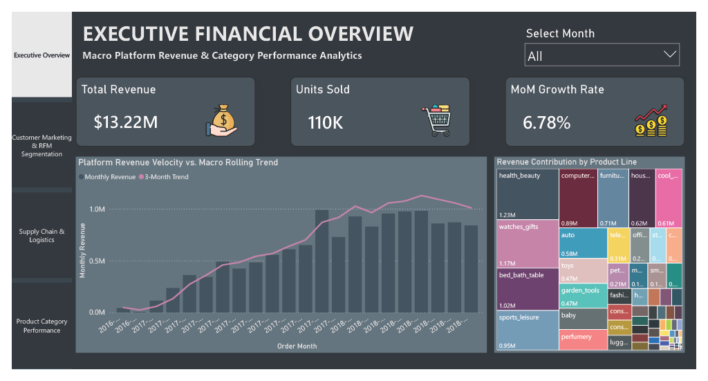
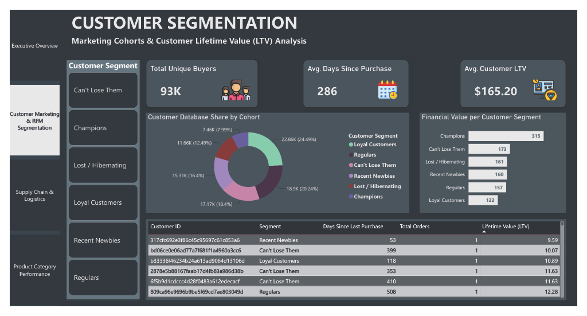
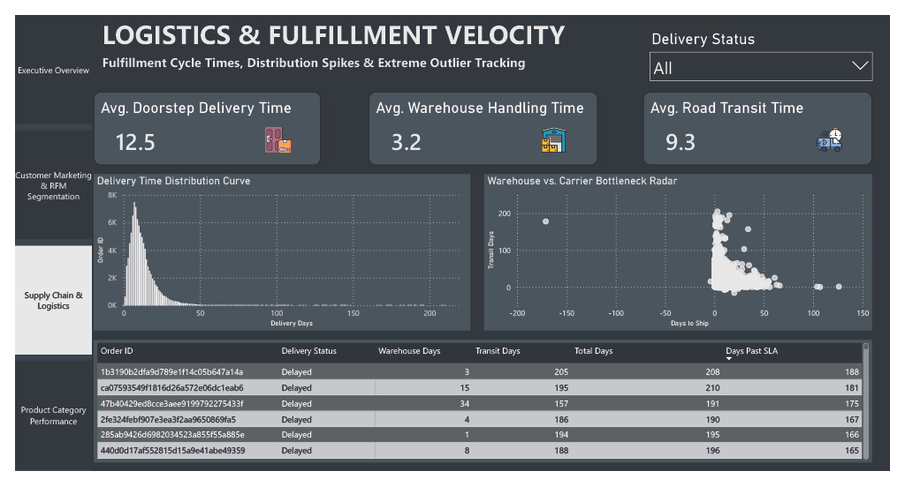
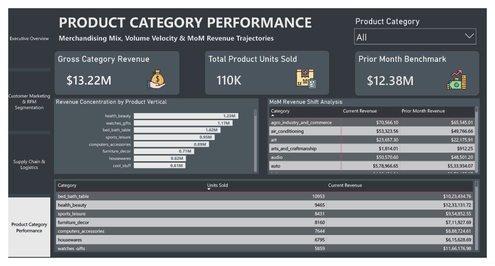

# Olist E-Commerce Marketplace Analytics Suite

---

## 📝 Overview
Modern e-commerce marketplaces process millions of transactions, but valuable operational insights are often lost across siloed database tables. This project builds an end-to-end ELT (Extract, Load, Transform) data engineering pipeline and business intelligence application utilizing the **Olist Brazilian E-Commerce dataset**. 

By transforming over 100,000 raw relational records inside a MySQL server before serving them to Power BI, this suite provides an interactive enterprise command center. It bridges operational gaps by automating behavioral customer marketing, exposing logistics bottlenecks, tracking merchandise velocity, and securing real-time visibility into executive financial KPIs.

---

## ✨ Features
* **Interactive App-Shell Navigation:** Expanded 4-page canvas featuring a synchronized, responsive vertical navigation sidebar.
* **Algorithmic RFM Cohorts:** Automated segmentation classifying users into 5 distinct behavioral marketing tiers.
* **Granular Logistics Isolation:** Advanced metrics isolating processing friction into internal warehouse tasks vs. external shipping carrier networks.
* **Dynamic Slicing & Metric Controls:** High-visibility metric cards, time-series rolling trends, and quick filter panels for intuitive dashboard interaction.

---

## 🛠️ Tech Stack
* **Database & Transformation Layer:** MySQL Server v8.0+ (Complex SQL Views, Window Functions, DDL Schema Design)
* **Business Intelligence Layer:** Power BI Desktop (Star-Schema Modeling, Import Mode, Advanced DAX, Custom UI Styling)
* **Version Control:** Git & GitHub

---

## 📁 Folder Structure
```text
📁 olist-ecommerce-analytics-suite/
│
├── 📁 Dataset/                     # Raw relational Olist source CSV maps
│   ├── 📄 olist_customers_dataset.csv
│   ├── 📄 olist_orders_dataset.csv
│   └── 📄 ... [Truncated for space]
│
├── 📁 Documentation/               # Central project governance documents
│   ├── 📄 data_dictionary.md       # MySQL View schema fields & definitions
│   └── 📄 metric_definitions.md    # Formulations for DAX, RFM, and logistics
│
├── 📁 Images/                      # High-DPI application screenshots
│   ├── 🖼️ customer-segmentation.png.png
│   ├── 🖼️ executive-overview.png.png
│   ├── 🖼️ logistics-velocity.png.png
│   └── 🖼️ product-performance.png.png
│
├── 📁 PowerBI/                     # Compiled front-end reporting application
│   └── 📊 olist_e_commerce.pbix
│
├── 📁 SQL/                         # Sequential pipeline execution scripts
│   ├── 📜 create_database.sql      # Database container initialization
│   ├── 📜 createtable.sql          # Relational constraint architecture
│   ├── 📜 data_ingestion.sql       # Bulk CSV population scripts
│   ├── 📜 data_transformation.sql  # Cleansing and text standardization
│   └── 📜 bi_reporting_views.sql   # final analytical reporting schemas
│
├── 📄 .gitignore                   # Excludes temp Power BI backup files
└── 📄 README.md                    # Main repository portfolio documentation
```

---

## 📊 Dataset
The suite processes the public **Olist Brazilian E-Commerce Dataset** containing real commercial data from 2016 to 2018. The data schema traces real-world platform complexities, including multi-item checkout flows, geolocated shipping lines across Brazil, various payment systems, and customer reviews. 

The raw source layer is treated as a relational network of **9 interconnected tables**, which are cleaned and structured during database ingestion.

---

## 🚀 Installation
Follow these steps to deploy the complete pipeline locally:

### 1. Rebuild the Database Pipeline (MySQL)
Log into your local MySQL command line interface (CLI) or preferred IDE and execute the scripts within the `SQL/` folder in sequential order:
```bash
# Initialize database container
mysql -u your_username -p < SQL/create_database.sql

# Generate relational schema rules and keys
mysql -u your_username -p olist_database < SQL/createtable.sql

# Ingest raw source files
mysql -u your_username -p olist_database < SQL/data_ingestion.sql

# Cleanse text headers and transform strings
mysql -u your_username -p olist_database < SQL/data_transformation.sql

# Compile the final reporting engine views
mysql -u your_username -p olist_database < SQL/bi_reporting_views.sql
```

### 2. Connect the Dashboard Application (Power BI)
1. Open `PowerBI/olist_e_commerce.pbix` in Power BI Desktop.
2. Navigate to **Transform Data** > **Data Source Settings**.
3. Select the data sources, choose **Change Source**, and point the connection parameters to your local MySQL host address.
4. Click **Apply Changes** to trigger data population.

---

### 🖥️ Screenshots

1. **Executive Financial Overview**


2. **Customer Marketing & RFM Segmentation**


3. **Supply Chain & Logistics Velocity**


4. **Product Category Performance**



---

## 🎯 Results & Insights

* **Macro Scale & Financial Health:** The platform has captured **$13.22M in Gross Revenue** across **110K product units sold**, maintaining an active month-over-month growth rate vector of **6.78%**.
* **Cohort Concentration Risks:** Regulars and Loyal Customers represent the largest structural pillars of the active buyer directory (accounting for **44.73% combined**). However, a high-value customer cluster has fallen into the **"Can't Lose Them"** bucket, identifying an immediate opportunity for targeted marketing intervention.
* **Logistical Friction Factors:** End-to-end platform transit averages **12.5 days**. Breaking this down reveals that third-party road shipping carriers account for the vast majority of delays (**9.3 days average transit time**), whereas internal warehouse preparation remains lean (**3.2 days average handling time**).
* **Merchandise Trajectories:** The **Health & Beauty** vertical leads total platform sales volume at **$1.23M total revenue**, closely followed by the **Watches & Gifts** sector at **$1.17M**.

---

## 🔮 Future Improvements
* **Automated ELT Orchestration:** Migrating the local, manual MySQL script run workflow into an automated orchestrator like Apache Airflow.
* **Predictive ML Extensions:** Injecting Python/Machine Learning models to forecast future product demand cycles and calculate predictive customer lifetime value (CLV).
* **Live DirectQuery Connectivity:** Migrating historical transactional records into a cloud data warehouse (such as Snowflake or Google BigQuery) to transition visuals from Import Mode to real-time streaming connections.
